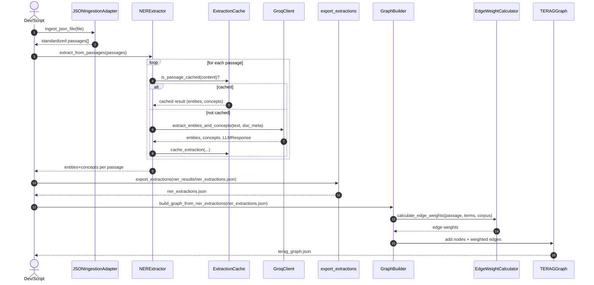
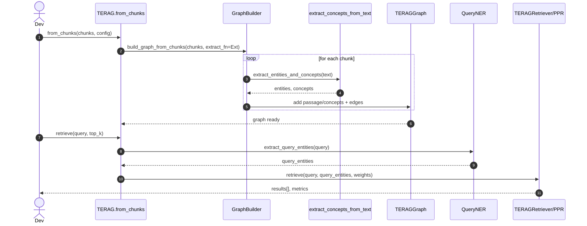
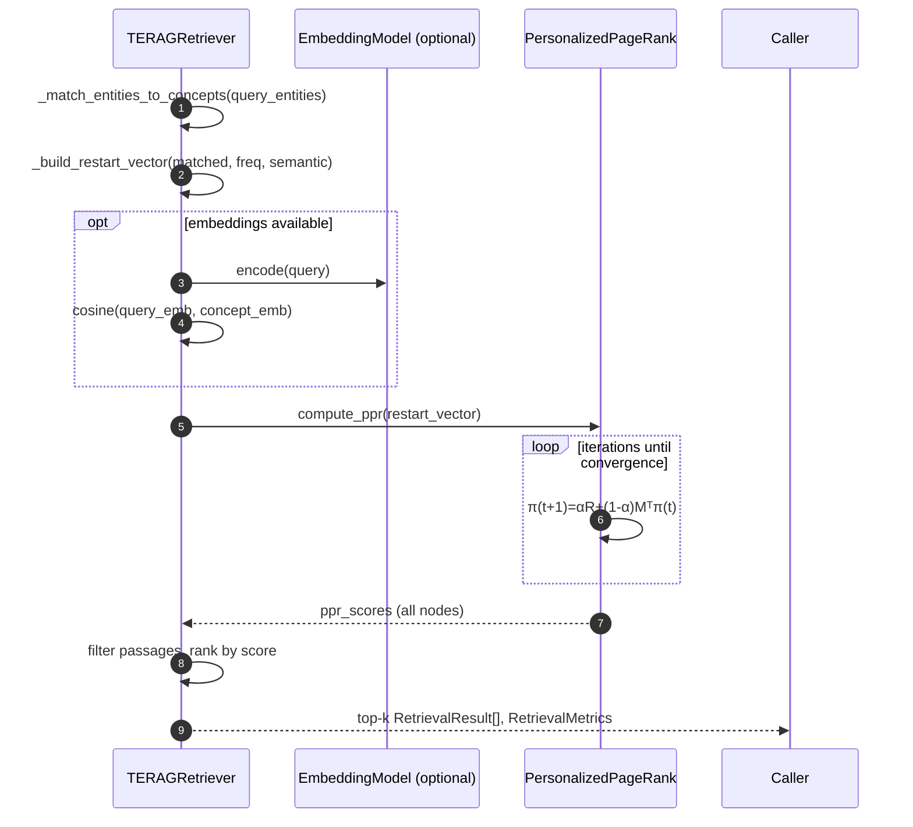
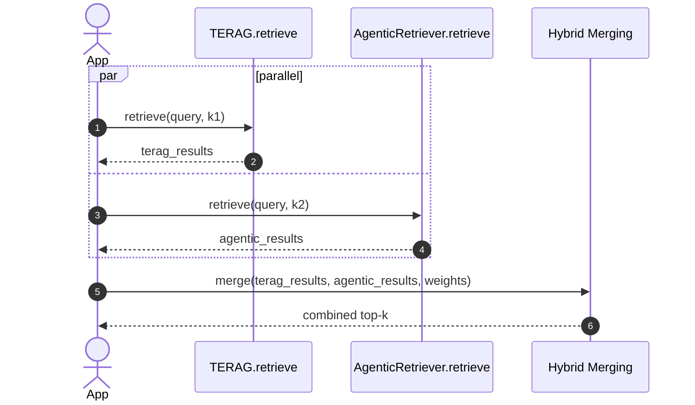

# TERAG Code Paths: Ingestion → Graph → Retrieval (and Beyond)

This document maps the end-to-end flows in this repository: how input data is ingested, normalized, enriched (NER), built into a graph, optionally deduplicated/merged, and finally used for retrieval via Personalized PageRank (PPR). It also highlights optional paths for embeddings, visualization, and hybrid integrations. The content reflects the latest code in this repo snapshot.

Sections reference concrete entry points and files so you can jump into the code quickly.

## High-Level Architecture

- Inputs: JSON files, pre-chunked passages, or pre-extracted NER results
- Processing stages:
  1) JSON ingestion and normalization
  2) NER extraction with caching (LLM or regex fallback)
  3) Graph construction (passages + concepts, adjacency lists, optional weighted edges)
  4) Optional entity deduplication + graph merging
  5) Retrieval with Personalized PageRank (frequency + semantic weighting)
  6) Optional embeddings utilities and query processing helpers
  7) Visualization and export

```
JSON files → Ingestion → Standardized passages → NER (w/ cache) → Extractions.json
    ↘ (alt) Pre-chunked passages ───────────────────────────────┘
                ↓
         Graph Builder (TERAGGraph) [optional weighted edges]
                ↓
        (optional) Entity Deduplication → Entity Merge
                ↓
        Retrieval (PPR + restart vector) → Top‑k passages
                ↓
             LLM answer (outside this repo)
```

## What’s New / Notable Changes

- Hybrid edge weighting for passage↔concept edges when building from NER exports (`edge_weight_calculator.py`): combines TF‑IDF‑style frequency, position-in-passage, entity type importance, and local context keywords.
- Universal JSON ingestion with speaker attribution (`json_ingestion.py`): formats Q&A/commentary with speaker names to improve graph connectivity; includes auto detection and custom rules.
- Persistent, resumable NER cache with progress and cost estimates (`extraction_cache.py`) and Groq LLM wrapper with retries (`groq_client.py`).
- Optional 3‑phase entity dedup + graph merge (`entity_deduplicator.py`, `entity_merger.py`).
- Embedding utilities and a query processor for embedding‑based entity matching (`embedding_manager.py`, `query_processor.py`).
- Visualization/export utilities to GraphML/GEXF/GML/PNG/HTML (`graph_visualizer.py`, demos).

## Core Data Models

- Graph: `TERAGGraph` with nodes for passages and concepts; adjacency lists for passage→concept and concept→passage.
  - File: `graph_builder.py` (classes `TERAGGraph`, `PassageNode`, `ConceptNode`)
  - Stores weighted or unweighted edges, supports serialization to JSON and conversion to NetworkX.

## 1) Ingestion (JSON → Standardized Passages)

- Goal: Convert diverse JSON structures into a standardized passage format for NER.
- Entry points:
  - `json_ingestion.py` (class `JSONIngestionAdapter`)
    - Auto-detects structure: `detect_json_structure`
    - Applies `IngestionRule` to produce `StandardizedPassage` objects
    - Key methods: `apply_ingestion_rule`, `ingest_json_file`, `ingest_multiple_files`

Outputs of ingestion: list of dicts per passage compatible with NER:
- `{ "content": str, "document_metadata": {...}, "passage_metadata": {...} }`

Speaker attribution and content composition for Q&A/commentary:
- See `test_speaker_attribution.py` and `JSONIngestionAdapter._combine_content_with_speakers` for how names are injected to improve entity connectivity.

Demo path:
- `json_ner_demo.py`:
  - Analyzes structures (`analyze_json_files`)
  - Runs ingestion per file (`ingest_json_file`) to produce passages for NER

## 2) NER Extraction + Caching

- Goal: Extract named entities and document-level concepts per passage; persist to cache; resumeable processing.
- Entry points:
  - `ner_extractor.py`:
    - `NERExtractor.extract_entities_and_concepts(text, document_metadata, passage_metadata)`
      - Primary path: Groq LLM (`groq_client.py`) with retries and cost estimates
      - Fallback: regex/patterns; capitalized phrase heuristics
    - `QueryNER` for lightweight query-time NER
    - Convenience: `extract_concepts_from_text(text)` used by graph building from raw chunks
  - `extraction_cache.py`:
    - `ExtractionCache` stores per-passage results, progress, api usage; provides `export_extractions` to JSON
  - `groq_client.py`:
    - LLM wrapper with retry, token/cost estimation, response parsing

Outputs of NER (when exporting):
- `ner_results/ner_extractions.json` (see `json_ner_demo.py`)
  - Each record contains `content`, `entities`, `concepts`, and metadata.

## 3) Graph Construction

Two equivalent inputs to graph building:
- A) Pre-chunked passages (and call the extractor live)
- B) Pre-extracted NER JSON (no LLM calls during graph build)

Implementation:
- File: `graph_builder.py` (class `GraphBuilder`)

Path A: From raw chunks
- `GraphBuilder.build_graph_from_chunks(chunks, extract_concepts_fn)`
  - Creates passage nodes, calls `extract_concepts_fn` on each `chunk['content']`
  - Adds concept nodes (type: `named_entity` or `document_concept`)
  - Filters by frequency thresholds (`min_concept_freq`, `max_concept_freq_ratio`)
  - Adds bidirectional edges (default weight 1.0 in this path)
  - Used by `TERAG.from_chunks` via `extract_concepts_from_text`

Path B: From NER extractions
- `GraphBuilder.build_graph_from_ner_extractions(ner_extractions_file)`
  - Reads exported NER results from cache
  - Builds nodes and computes hybrid edge weights via `EdgeWeightCalculator`
    - Components: TF‑IDF‑like frequency, position in passage, entity type importance, local context keywords
  - Adds weighted edges passage↔concept

Graph model and utilities:
- `TERAGGraph` methods: `add_passage`, `add_concept`, `add_edge`, `get_statistics`, `save_to_file`, `load_from_file`, `to_networkx`, `get_networkx_statistics`
- Optional concept clustering stub exists (`_cluster_concepts`)

Edge weighting behavior by path:
- From chunks + live extraction: edges default to uniform weight (1.0) today.
- From NER exports: edges receive hybrid weights via `EdgeWeightCalculator`.

Outputs:
- `terag_graph.json` (save/load)
- Optionally, NetworkX formats (`.graphml`, `.gexf`, `.gml`, pickle) via visualizer/demo scripts

## 4) Optional: Entity Deduplication + Merge

Purpose: Consolidate duplicate entities while preserving graph structure.

- `entity_deduplicator.py` (`EntityDeduplicator`):
  - Phase 1: fuzzy string similarity
  - Phase 2: embedding-based similarity (optional; sentence-transformers)
  - Phase 3: graph-based validation (co-occurrence/Jaccard)
  - Produces a mapping `duplicate_entity_text → canonical_entity_text`

- `entity_merger.py` (`EntityMerger`):
  - Applies mapping to graph: rebuilds concept nodes, redirects edges (keeps max combined edge weight), preserves passage nodes
  - Provides merge statistics and a detailed report helper

Demo:
- `deduplicate_graph_demo.py` – runs dedup pipeline on an existing `terag_graph.json`, exports a deduplicated graph and reports.

## 5) Retrieval: Personalized PageRank (TERAG main path)

Entry points:
- `terag_retriever.py` (class `TERAG`): high-level façade
  - `TERAG.from_chunks(chunks, config, embedding_model)` → builds graph then retrieval-ready object
  - `TERAG.from_chunks_file(path, ...)` and `TERAG.from_graph_file(path, ...)`
  - `TERAG.retrieve(query, top_k)`
    - Query NER via `QueryNER` (pattern-based; optional LLM enhancement)
    - Delegates to `ppr_retriever.TERAGRetriever`

- `ppr_retriever.py` (classes `PersonalizedPageRank`, `TERAGRetriever`):
  - Matches query entities to graph concepts (exact/partial fuzzy match by text)
  - Builds restart vector per matched concept combining:
    - Frequency weight: inverse concept frequency (approx. IDF over passage count)
    - Semantic weight: cosine similarity between query and concept embeddings (if embedding model provided)
  - Runs PPR over bipartite graph to compute node scores
  - Ranks passages by their PPR scores and returns top‑k with matched concepts and metadata

Notes on embeddings in retrieval:
- If an embedding model is supplied (e.g., sentence-transformers), concept embeddings are precomputed and used for semantic weights.
- Without embeddings, retrieval still works based on frequency/graph structure.

PPR (Plain‑language explanation for Product Managers):
- Think of the graph as a map of passages and concepts. We start by “lighting up” the concepts related to your query (e.g., Apple, revenue, Q4). PPR then spreads this attention through the connections in the graph, but keeps snapping back to those query concepts at a steady rhythm. Passages closely connected to the lit‑up concepts accumulate more attention and rise to the top. In effect, PPR is a fast, low‑cost way to prioritize the most relevant passages by combining “who is mentioned” with “how everything is connected,” without requiring heavy LLM calls.

## 6) Optional: Embedding Utilities + Query Processor

- `embedding_manager.py` (`EmbeddingManager`): caches OpenAI `text-embedding-3-small` vectors for texts; can embed all graph entities/passages and persist a pickle cache.
- `query_processor.py` (`QueryProcessor`): a helper for “dual-layer” style query handling
  - Loads entity embeddings from graph
  - Extracts entities from the query by embedding similarity to graph concepts and produces a `ProcessedQuery`
  - This can augment routing or hybrid strategies but is not required for the PPR retriever to function.

## 7) Visualization and Export

- `graph_visualizer.py` (`GraphVisualizer`, `visualize_terag_graph`):
  - Matplotlib static plots, Plotly interactive, Pyvis networks
  - Exports graph to GraphML, GEXF, GML, edgelist for external tools

Demo scripts:
- `visualization_demo.py` – builds a sample graph and produces multiple visualizations/exports
- `build_graph_demo.py` – converts NER extractions to TERAG graph + multiple export formats with stats

---

## End-to-End Code Paths

### Path A: Pre‑chunked passages → Build + Retrieve (no external NER file)

1. Build TERAG from chunks
   - `terag_retriever.TERAG.from_chunks(chunks, config, embedding_model=None)`
     - Calls `GraphBuilder.build_graph_from_chunks(..., extract_concepts_fn=ner_extractor.extract_concepts_from_text)`
     - Creates `TERAG(graph, config, embedding_model)` with `PPRRetriever`
2. Retrieve
   - `TERAG.retrieve(query, top_k)`
     - `QueryNER.extract_query_entities(query)`
     - `PPRRetriever.retrieve(query, query_entities, ...)`
     - Returns `List[RetrievalResult]` and `RetrievalMetrics`

When to use: quick start from an in‑memory list of chunks or a JSON chunks file.

### Path B: JSON files → Ingestion → NER (cached) → Weighted Graph → (optional) Dedup → Retrieve

1. Ingestion
   - `JSONIngestionAdapter.ingest_json_file(...)` or `ingest_multiple_files(...)` → standardized passages
2. NER + Caching
   - `NERExtractor.extract_from_passages(passages)` with `ExtractionCache`
   - Export: `extraction_cache.export_extractions(...)` → `ner_extractions.json`
3. Graph Build (weighted)
   - `GraphBuilder.build_graph_from_ner_extractions("ner_extractions.json")`
     - Uses `EdgeWeightCalculator.calculate_edge_weights(...)`
4. (Optional) Deduplicate + Merge
   - `EntityDeduplicator` → entity mapping → `EntityMerger.apply_entity_mapping`
5. Retrieve
   - `TERAG.from_graph_file("terag_graph.json")` and then `TERAG.retrieve(...)`

When to use: scalable pipelines, resumable NER, better edge weighting signal.

### Path C: Hybrid with an external dense/sparse retriever

- See `INTEGRATION_GUIDE.md` for patterns: sequential, parallel, and query routing.
- Typical flow: use TERAG to retrieve entity/graph‑relevant passages, then refine with dense+sparse retriever; merge scores.

---

## Configuration and Knobs

- Graph building (`GraphBuilder`):
  - `min_concept_freq`, `max_concept_freq_ratio` to filter noisy concepts
  - `enable_edge_weights` (on by default for NER‑file path)
  - `separate_entity_concept_types` to differentiate entities vs concepts
  - `enable_concept_clustering` (stub for future); when enabled, `_cluster_concepts` could reduce graph size

- Retrieval (`TERAGConfig` and `TERAGRetriever`):
  - `ppr_alpha`, `ppr_max_iterations`
  - `semantic_weight`, `frequency_weight` mix for restart vector
  - `top_k`

- Personalized PageRank core (`PersonalizedPageRank`):
  - `alpha` (same as above): restart probability; higher α keeps results focused on matched concepts, lower α explores more of the graph
  - `tolerance`: convergence threshold (default 1e‑6)
  - `max_iterations`: safety cap (also surfaced via `TERAGConfig.ppr_max_iterations`)

- NER (`NERExtractor`):
  - `use_fallback` regex mode if LLM is unavailable
  - Caching directory and progress reporting

- Embeddings (`EmbeddingManager`):
  - OpenAI model and cache directory; batch sizes and retry settings

- Query Processor (`QueryProcessor`):
  - `entity_similarity_threshold` (default 0.7): how strict entity matching is
  - `max_entities_per_query` (default 10): cap for extracted entities
  - `enable_query_expansion`: can enrich matching for recall
  - Works together with `EmbeddingManager` configuration

- Deduplication (`EntityDeduplicator`):
  - `string_similarity_threshold` (default 0.8)
  - `embedding_similarity_threshold` (default 0.85)
  - `graph_similarity_threshold` (default 0.6) based on co‑occurrence; governs merge aggressiveness

- Edge Weights (`EdgeWeightCalculator`):
  - Internals combine TF (normalized), IDF (corpus rarity), position in passage (early/late boost), entity type weights (e.g., PERSON > ORG > LOC > CONCEPT), and context keywords; intended to be rule‑based and API‑free.

### Tuning Cheatsheet (influence outcomes)

- Precision vs. recall in retrieval:
  - Raise `TERAGConfig.semantic_weight` if you provide embeddings and want tighter semantic focus.
  - Raise `TERAGConfig.frequency_weight` to emphasize rare, distinctive concepts (better precision on entity‑centric queries).
  - Increase `ppr_alpha` (e.g., 0.2 → 0.3) to keep results anchored around matched concepts; decrease to explore more broadly.
  - Adjust `top_k` depending on downstream reranking/answering needs.

- Graph size and noise control:
  - Increase `min_concept_freq` and/or lower `max_concept_freq_ratio` to remove very rare or overly common concepts.
  - Use dedup to consolidate near‑duplicate entities before retrieval.

- Edge signal strength (when using NER exports):
  - Keep `enable_edge_weights=True` to leverage hybrid weights; helps rank passages where entities are more salient.

- Query robustness:
  - If using `QueryProcessor`, lower `entity_similarity_threshold` to catch more candidates; increase for stricter matching.

---

## Error Handling and Fallbacks

- NER: If Groq client is unavailable or fails, regex/pattern‑based fallback extracts reasonable entities/concepts.
- Embeddings: If embedding APIs are not configured, retrieval still functions using frequency/graph signals (semantic weight defaults).
- Export: Visualization/export routines guard against missing third‑party libs and attempt simplified fallbacks (e.g., simplified GraphML attributes).

---

## Quick Pointers (Where to Look)

- Build graph from chunks quickly: `terag_retriever.py:TERAG.from_chunks`
- Build graph from NER JSON: `graph_builder.py:GraphBuilder.build_graph_from_ner_extractions`
- Main retrieval call: `terag_retriever.py:TERAG.retrieve`
- PPR core: `ppr_retriever.py:PersonalizedPageRank.compute_ppr`
- Restart vector weighting: `ppr_retriever.py:TERAGRetriever._build_restart_vector`
- Hybrid edge weights (NER‑file path): `edge_weight_calculator.py`
- Ingestion rules + speaker attribution: `json_ingestion.py`
- NER caching: `extraction_cache.py`
- Visualization: `graph_visualizer.py`

---

## Minimal End‑to‑End Snippets

- From chunks JSON file to retrieval:
  - `terag = TERAG.from_chunks_file("chunks_full_metadata.json", config=TERAGConfig(min_concept_freq=2))`
  - `results, metrics = terag.retrieve("What was the revenue in 2024?", top_k=10)`

- From JSON files with NER caching to weighted graph and retrieval:
  - Run `json_ner_demo.py --files data/*.json --output ner_results/` → produces `ner_results/ner_extractions.json`
  - Run `build_graph_demo.py --ner-file ner_results/ner_extractions.json --output-dir graph_results/`
  - `terag = TERAG.from_graph_file("graph_results/terag_graph.json")`
  - `results, metrics = terag.retrieve("Which companies competed?", top_k=10)`

---

If you want me to also include sequence diagrams (Mermaid) or cross-reference concrete line numbers for each function, say the word and I’ll extend this file accordingly.

## Mermaid Diagrams

Below are sequence diagrams for the main paths and the PPR internals. Render with any Markdown viewer that supports Mermaid.

### Path B: JSON files → Ingestion → NER (cached) → Weighted Graph



### Path A: Pre‑chunked passages → Build Graph (inline extraction) → Retrieve



### PPR Internals: Restart Vector + Power Iteration



### Optional Hybrid: TERAG ↔ Dense/Sparse (Agentic) Merge


