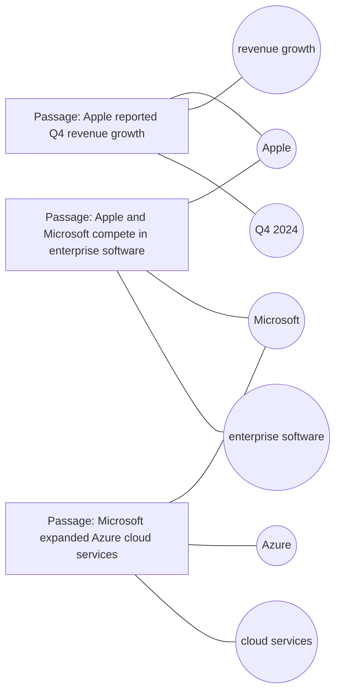
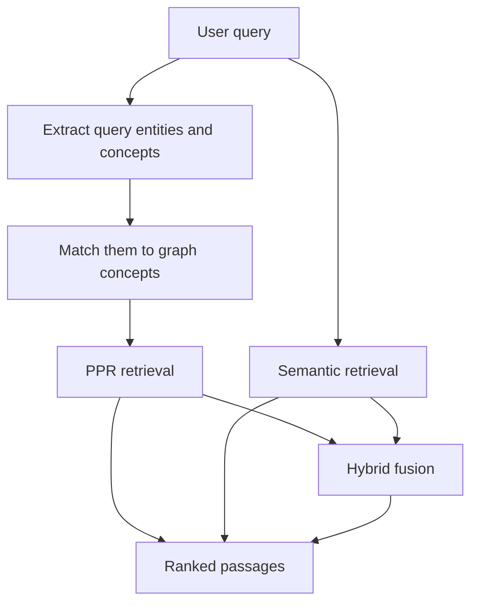
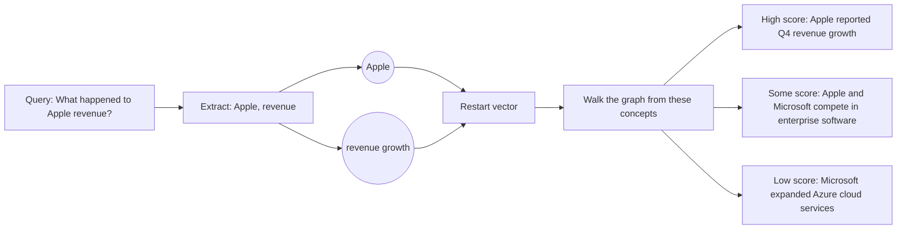
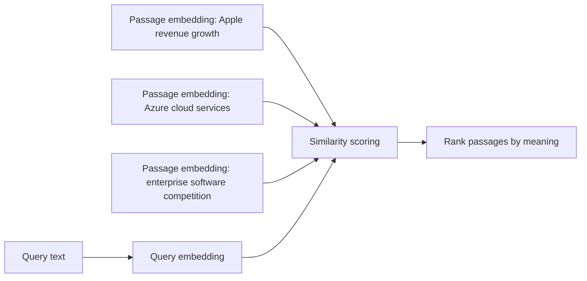
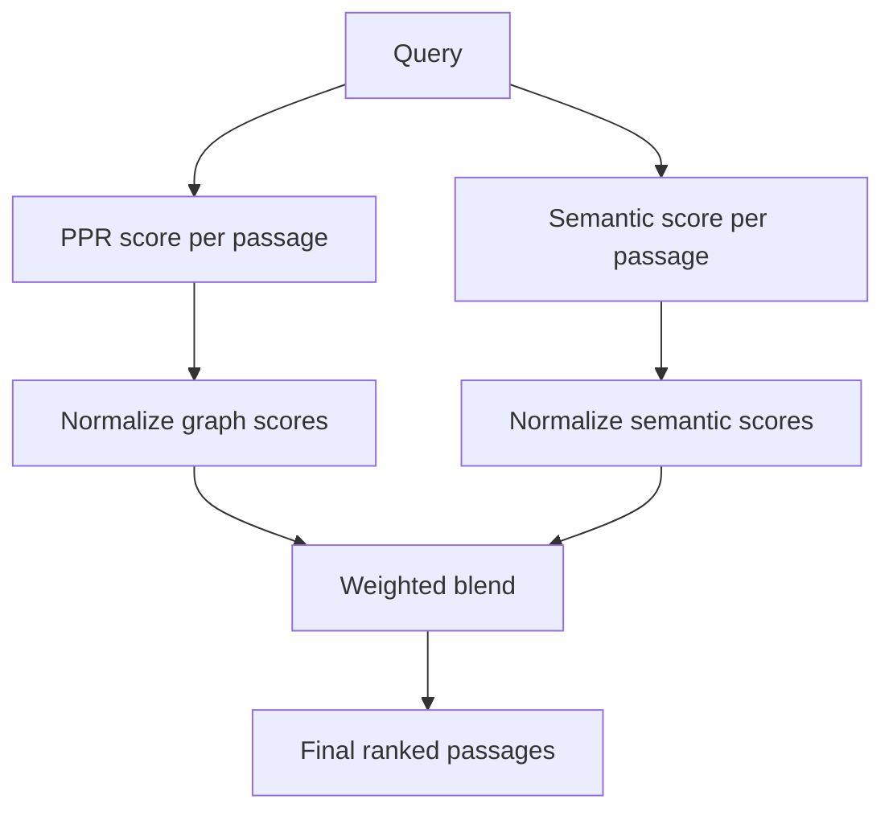

# How TERAG Retrieval Works

This page explains what happens after a graph has already been built and a query comes in.

## The Built Graph

TERAG stores chunks as passage nodes and extracted terms as concept nodes.



Think of this as a map. Passages are places on the map. Concepts are roads that connect related places.

## Query-Time Overview



The same query can use different retrieval modes depending on what the caller asks for.

## PPR Retrieval

PPR means Personalized PageRank. In plain terms, TERAG starts at the concepts that matched the query, then lets relevance flow through the graph.

Example query:

```text
What happened to Apple revenue?
```



Analogy: imagine dropping ink on the `Apple` and `revenue` nodes. The passages closest to that ink get darker first. Related passages can still get some ink if they are connected through shared concepts.

Best for:

- Questions with concrete names, dates, products, people, organizations, or domain terms.
- Cases where graph connections matter.
- Local/no-embedding usage.

## Semantic Retrieval

Semantic retrieval ignores graph paths and asks: "Which passage means something closest to the query?"



Analogy: instead of following roads on the map, semantic retrieval compares fingerprints. If the query fingerprint looks like a passage fingerprint, that passage ranks higher.

Best for:

- Paraphrases.
- Conceptual questions.
- Queries where entity extraction may miss the right wording.

Requires an embedding model.

## Hybrid Retrieval

Hybrid retrieval combines both signals:

- PPR score: graph evidence from matched concepts and connected passages.
- Semantic score: meaning similarity between query and passages.



Example:

```python
results = rag.query(
    "Which company improved financially?",
    method="hybrid",
    ppr_weight=0.6,
    semantic_weight=0.4,
)
```

Analogy: PPR is a map-based recommendation. Semantic retrieval is a meaning-based recommendation. Hybrid asks both judges, gives each judge a weight, and then blends their rankings.

Best for:

- General-purpose retrieval.
- Product use cases where embeddings are available.
- Queries that may need both exact entity grounding and fuzzy meaning.

## Current Explainability Gap

TERAG already returns `matched_concepts` on result objects for graph/PPR retrieval. A fuller visualization and trace API is still planned:

- matched query entities
- matched graph concepts
- graph neighborhoods
- PPR contribution
- semantic contribution
- hybrid blend contribution

Those are tracked in the adoption checklist under visual graph inspection and retrieval explainability.
